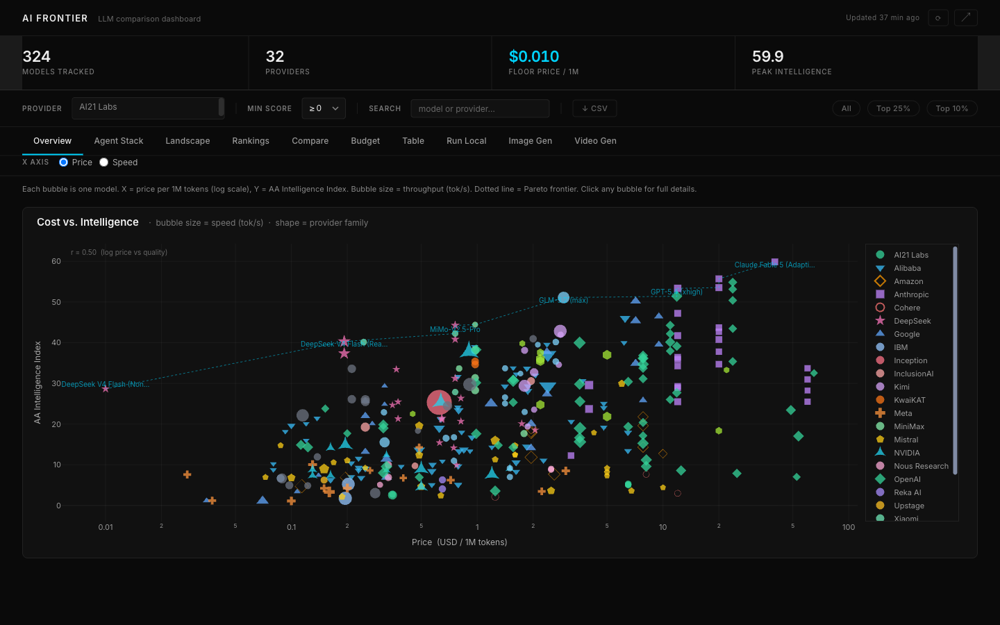
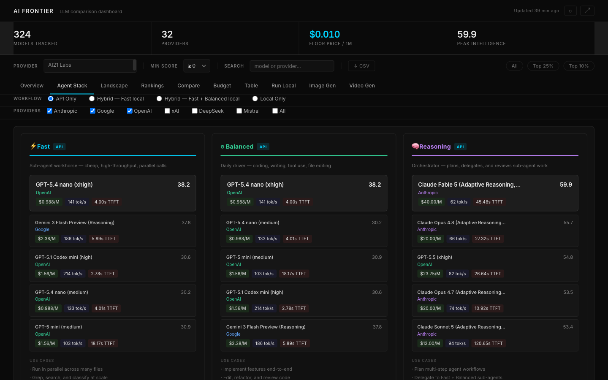
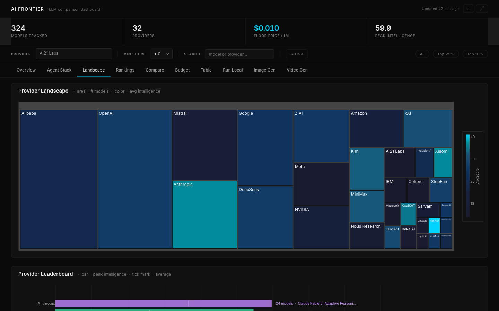
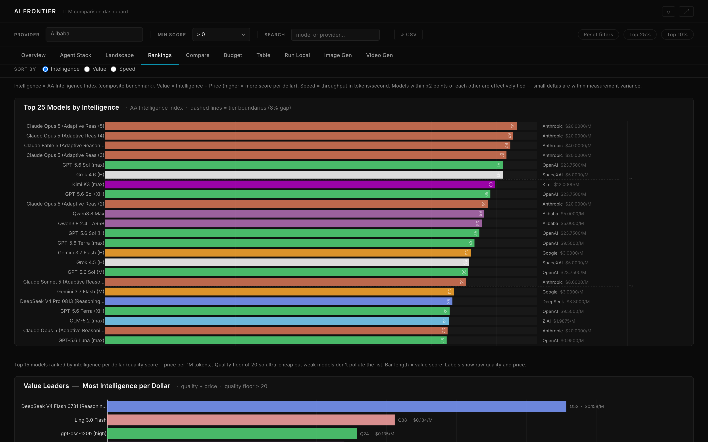
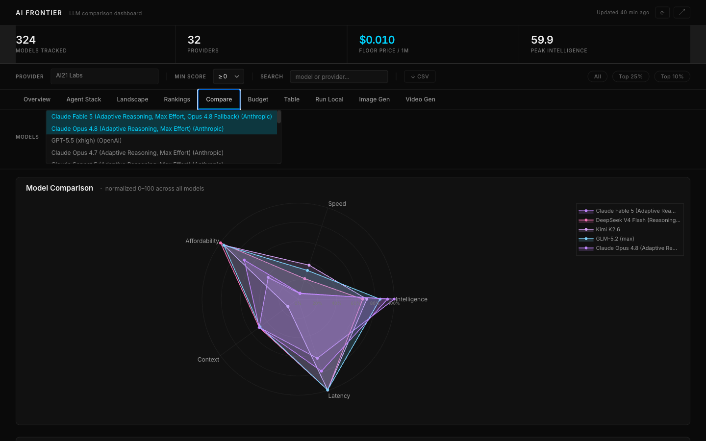
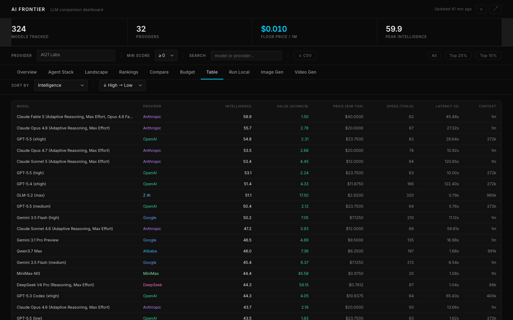

# AI Frontier

> An interactive dashboard mapping the entire AI model landscape — comparing every hosted language model Artificial Analysis benchmarks — 155 of them across 31 providers today — on cost, speed, and intelligence in one place, updated hourly.


### 🔗 Live dashboard → **https://avo-sarkissian.github.io/AI-Frontier-Database/**

Hosted free on GitHub Pages. The full interactive dashboard runs entirely in your browser — the same Python chart code is executed client-side via [Pyodide](https://pyodide.org/) (WebAssembly), so there is no server. Charts paint instantly from a pre-rendered snapshot; the live filters/calculators activate after a one-time background load (a few seconds, cached thereafter).



---

## Overview

Every week, new AI models ship from OpenAI, Google, Anthropic, Meta, and dozens of others. Each makes different tradeoffs — some excel at reasoning but cost more, some are fast but less capable, and some punch well above their price point.

**AI Frontier** makes those tradeoffs visible. A GitHub Actions bot scrapes live benchmark data from [Artificial Analysis](https://artificialanalysis.ai/) every hour and surfaces the full competitive landscape through 10 interactive tabs — no sign-in, no API key required.

---

## Dashboard Tabs

| Tab | Description |
|---|---|
| **Overview** | Bubble scatter of every model, togglable between Price and Speed on the x-axis (y = AA Intelligence Index either way). Dotted Pareto frontier highlights best value per dollar. The nine largest providers each get a distinct colour AND marker shape — a redundant encoding that survives colour-vision deficiency; the remaining providers share a grey "Other" series. |
| **Agent Stack** | Pick a workflow — API Only, Hybrid (fast local), Hybrid (fast + balanced local), or Local Only — plus a provider checklist, and get a three-tier model recommendation: Fast, Balanced, and Reasoning. Hybrid/Local modes add GPU, VRAM, and quantization controls. |
| **Landscape** | Treemap of the AI industry: tile area = model count per provider, color intensity = average intelligence. Followed by a provider leaderboard. |
| **Rankings** | Top 25 models by Intelligence, Value (score/$), or Speed, with tier-separator lines marking meaningful performance gaps — plus a "Value Leaders" chart ranking the top models by intelligence-per-dollar. |
| **Compare** | Head-to-head radar chart across five dimensions: Intelligence, Speed, Affordability, Context Window, and Latency. Supports up to 5 models simultaneously, with a raw-value table below the chart. |
| **Budget** | Enter a monthly token volume and see projected API cost per model, sorted cheapest-first. |
| **Table** | Full sortable table of every tracked model with every available metric. |
| **Run Local** | Select a GPU, quantization level, and capability tags (code, reasoning, vision, audio) to see which open-weight models fit in VRAM, with estimated inference speed. |
| **Image Gen** | ELO-based leaderboard of image generation models, filterable by provider and style tag, from the AA Image Arena. |
| **Video Gen** | Arena-Elo leaderboard of video generation models with per-minute pricing, from the AA Video Arena. Text-to-video and image-to-video are separate Elo pools with separate prices, so MODE switches between them. |

---

## Screenshots

> Captured from the built site by `scripts/capture_screenshots.py`, with the
> header stat bar hidden — those counters change hourly, and an image containing
> them is wrong within the hour. Regenerate after a UI change with:
> `.venv/bin/python build_static.py && .venv/bin/python scripts/capture_screenshots.py`


<table>
<tr>
<td width="50%"></td>
<td width="50%"></td>
</tr>
<tr>
<td width="50%"></td>
<td width="50%"></td>
</tr>
</table>



---

## Data Sources

| Metric | Source | Notes |
|---|---|---|
| Intelligence | [Artificial Analysis](https://artificialanalysis.ai/) | Composite of reasoning, coding, math, and knowledge benchmarks |
| Price | Derived from Artificial Analysis | USD per 1M tokens, cheapest available host. **Our blend, not AA's**: 3 parts output to 1 part input. AA publishes the opposite weighting (3 parts input to 1 part output), so a price here reads roughly 1.9× theirs. Output-weighted is the honest basis for agentic and RAG workloads, where output dominates spend; the per-token `price_in` / `price_out` are shown beside it everywhere so you can compute either. |
| Speed | Artificial Analysis | Median tokens/second from the same host as the price |
| Latency | Artificial Analysis | Median time-to-first-token (TTFT) in seconds |
| Context Window | Artificial Analysis | Maximum input length **the model supports**, not what a given host serves — a host may cap it lower. Unlike price and speed this is not a cheapest-host figure. |
| Image ELO | AA Image Arena | Human-preference ranking, scraped live hourly |
| Open-weight / local models | AA model leaderboard | Parameter counts, context, licence and Intelligence Index, scraped live hourly. Read from the leaderboard rather than the hosted-models API on purpose: that API is keyed on host x model, so it only knows about open-weight models someone also sells API access to — 77 of 177 were invisible, including every model nobody hosts precisely because you would run it yourself. |
| Video Elo | AA Video Arena | Human-preference ranking across two generation arenas, scraped live hourly |
| Video generation time | AA Video Arena | End-to-end median over 14 trailing days — published by AA for only a handful of endpoints, and left blank rather than estimated for the rest |

The LLM dataset currently covers **155 models** across **31 providers**. Counts move every hour as Artificial Analysis adds and delists models — the header stats on the live site are always authoritative, and this number was last written on a day the catalogue held 155. It has been as high as 329 (before AA pruned ~181 legacy models on 2026-07-24) and as low as 148. Four separate scrapers (`data/scraper.py`, `data/image_scraper.py`, `data/local_scraper.py`, `data/video_scraper.py`) each pull their own Artificial Analysis source on the same hourly cadence. Three of the four read a rendered page rather than an API — AA key-gated the image arena endpoint, never published a video one, and its models API returns host x model rows that omit unhosted open-weight models — so `data/rsc.py` holds the Next.js payload parsing they share. Only `data/scraper.py` still uses the JSON API, because the hosted catalogue genuinely wants per-host pricing.

---

## Live Data Refresh

An **hourly GitHub Actions workflow** (`.github/workflows/refresh.yml`) is the sole source of truth for the deployed site — browsers can't call the Artificial Analysis API directly (CORS), so a cron job (`23 * * * *`, plus manual `workflow_dispatch`) does it server-side:

1. Runs all four scrapers, falling back to the last-known-good cache per source if a fetch fails.
2. Sanity-checks row counts, per-column health, and per-column medians before proceeding — a rename that zeroes a column, or a units change that leaves the row count intact, both fail the build.
3. Skips the rebuild entirely if nothing changed (git-diff change guard).
4. Runs `python build_static.py --data-only` to swap the new CSVs into the static bundle without re-vendoring Plotly.
5. Commits and pushes the refreshed `docs/` folder as `github-actions[bot]`, which GitHub Pages auto-deploys.

The live site auto-loads the latest published snapshot on open.

**The freshness badge reports data age, not build age.** Each scraper records
whether it actually fetched, when, and how many rows (`data/raw/scrape_status.json`),
and the badge shows the **oldest** successful fetch across all four datasets —
because a dashboard is only as fresh as its stalest panel. If any dataset is
failing or older than three hours the badge turns amber and adds a ⚠; hover it
for a per-dataset breakdown. Staleness is recomputed in the browser, so a page
left open ages honestly even if the hourly job stops.

That badge used to read the *build* timestamp. On one real CI run two of three
scrapers failed, only the image arena refreshed, and a five-hour-stale catalogue
published under "Updated just now" — with the failure step running *after* the
push.

---

## Running Locally

Requires **Python 3.11+**.

```bash
# Clone the repo
git clone https://github.com/Avo-Sarkissian/AI-Frontier-Database.git
cd AI-Frontier-Database

# Create and activate a virtual environment.
# Use .venv, not a name containing spaces: this repo lives under a path with a
# space in it, and a venv whose activate script embeds that path silently
# prepends a directory that does not exist. The script still exits 0 and still
# sets the (name) prompt, so you get the SYSTEM python believing you are in a
# venv — which is how a build once ran under plotly 6.0 and tripled the bundle.
python -m venv .venv
source .venv/bin/activate         # Windows: .venv\Scripts\activate
python -c "import sys; print(sys.prefix)"   # must print .../AI Frontier/.venv

# Install dependencies. requirements.txt is the human-edited file;
# requirements.lock is what CI installs, with a sha256 for every artifact.
pip install -r requirements.txt

# Launch the dashboard
python app.py
```

Open **http://localhost:8050**. The scrapers fetch fresh data on startup and run in the background every hour — no manual refresh needed. (They are skipped under `pytest`, so the suite never touches the network or the committed cache.)

### Tests

```bash
.venv/bin/python -m pytest -q        # 380 tests, ~30s
```

Run them from `.venv`, not the system Python: four full-build tests **silently
skip** when the ambient plotly ships the pre-6.1 validator tree, so a green run
outside the venv is not a green run.

The suite is mostly regression tests for defects an audit found, and each one
names the failure it prevents rather than the function it calls — the docstrings
are the useful documentation of why the code is shaped the way it is. Broadly:

| File | Guards |
|---|---|
| `test_data_semantics.py` | Price basis and attribution, context-window source, upstream renames, the row-loss guards |
| `test_encoding_calibration.py` | Every constant that decides a bar length, bubble size, spoke radius or colour stop matches the range the data occupies |
| `test_filter_semantics.py`, `test_controls_and_drift.py` | Controls do what they are labelled to do, and both renderings agree |
| `test_pipeline_and_hardware.py` | Empty states, freshness, atomic publishing, the local-hardware model |
| `test_claims_and_injection.py` | The product's claims about itself; scraped text reaching Plotly or a spreadsheet |
| `test_pybundle_freshness.py` | The deployed bundle matches the repo — a fix that is not shipped fails here |

---

## Static site (GitHub Pages)

The public site at **https://avo-sarkissian.github.io/AI-Frontier-Database/** is a static, server-free build of the same dashboard, served from the `docs/` folder on `main`.

```bash
# Regenerate the static site into docs/ (pre-rendered figures + Pyodide bundle)
python build_static.py

# Or, after a data-only refresh (see Live Data Refresh above):
python build_static.py --data-only

git add docs && git commit -m "rebuild static site" && git push   # Pages auto-deploys (~1 min)
```

How it works: `build_static.py` pre-renders every chart's default state to JSON and zips the project's Python (chart builders, data loaders, `static_api.py`) plus `plotly` into `docs/pybundle.zip`. The page loads the pre-rendered figures instantly, then boots Pyodide in the background and calls the **same** Python chart code in the browser for live filtering — so the static site is faithful to the Dash app with zero hosting cost. In normal operation the [hourly GitHub Actions bot](#live-data-refresh) handles the refresh + rebuild + deploy automatically; the manual commands above are only needed for local iteration or a full rebuild.

---

## Architecture

```
app.py                     # Dash app entry point, tab routing, background scrapers
components/
  charts/                  # One module per visualization; constants.py holds the
                           #   shared palette, escaping, and fixed-reference helpers
  stack_recommender.py     # Agent Stack tab recommendation logic
data/
  scraper.py               # Live LLM data — Artificial Analysis
  image_scraper.py         # Live image-gen data — AA Image Arena
  local_scraper.py         # Live open-weight model data — AA model leaderboard
  video_scraper.py         # Live video-gen data — AA Video Arena (both generation arenas)
  rsc.py                   # Next.js RSC payload parsing shared by the image + video scrapers
  ingest.py                # Parses scraper output, manages CSV cache and daily history
  scrape_status.py         # Per-dataset ok/fetched_at/rows — drives the freshness badge
  image_models.py, local_models.py, video_models.py   # Per-domain data access helpers
  raw/                     # Live cache, coverage, scrape status + daily snapshots
assets/style.css           # Global dark theme, typography (copied into docs/ by the build)
captions.py                # Every chart caption, read by app.py AND shipped in the manifest
static_helpers.py          # Pure dash-free helpers shared by app.py + the static build
static_api.py              # Browser bridge — Dash callbacks as JSON-returning functions (Pyodide)
build_static.py            # Pre-renders figures + bundles Python into docs/ for GitHub Pages
data_guard.py              # Row-loss, cumulative-drain and per-column median checks
docs/                      # The static GitHub Pages site (index.html, app.js, figures/, pybundle.zip)
scripts/
  capture_screenshots.py   # Regenerates the README screenshots from the built site
  build_report.sh          # Compiles report.tex -> FinalReport_Sarkissian.pdf
.github/workflows/refresh.yml   # Hourly bot: scrape → guard → rebuild → commit + push
tests/                     # 380 tests: data semantics, encoding calibration, control
                           #   behaviour, pipeline integrity, injection surfaces
```

### Two renderings, one source

The Dash app and the static site run the **same** Python. Everything a chart
needs — palettes, captions, filter vocabularies, numeric defaults, provider
aliases — lives in one module and is either imported by both or shipped to the
browser in `docs/figures/manifest.json`. That is not tidiness: the recurring
defect in this codebase has been two copies of one fact drifting apart, so the
rule is **derive, never synchronise**, and tests assert the two sides agree.

The deployed site executes the Python **inside `docs/pybundle.zip`**, not the
repo's `.py` files. The hourly bot only swaps data CSVs into that zip, so a code
change needs a full `build_static.py` to reach visitors —
`tests/test_pybundle_freshness.py` fails if the two ever diverge.

---

## Built With

| Tool | Role |
|---|---|
| [Plotly Dash](https://dash.plotly.com/) | Interactive web framework — Python functions rendered as a live site |
| [Plotly](https://plotly.com/python/) | All charts and visualizations |
| [Pandas](https://pandas.pydata.org/) | Data ingestion, filtering, and Pareto computation |
| [requests](https://docs.python-requests.org/) | Live data scraping from the Artificial Analysis API |
| [NumPy](https://numpy.org/) | Numerical operations (Pareto frontier, correlation) |
| [Pyodide](https://pyodide.org/) | Runs the Python chart code in the browser (WebAssembly) for the static site |
| [GitHub Actions](https://github.com/features/actions) | Hourly scrape → rebuild → deploy bot |
| [GitHub Pages](https://pages.github.com/) | Free static hosting for the live dashboard — auto-deploys on every push to `main` |
| [pytest](https://docs.pytest.org/) | 380 regression tests, each named for the defect it prevents |
| [Playwright](https://playwright.dev/python/) | Drives the built site to regenerate the README screenshots |
| [Tectonic](https://tectonic-typesetting.github.io/) | Compiles `report.tex` without a full TeX install |

---

*Data Visualization — EECE 5642, Northeastern University, Spring 2026*

---

## Written report

`report.tex` is the source; `FinalReport_Sarkissian.pdf` is built from it and is
current. `neurips_2024.sty` is vendored beside it so the build needs nothing
fetched by hand.

```bash
brew install tectonic       # one-time; fetches its own TeX packages
./scripts/build_report.sh   # report.tex -> FinalReport_Sarkissian.pdf
```

This used to be a comment reading "compile on Overleaf", and the PDF drifted
from its source: the text was corrected while the PDF beside it kept printing
inflated model and provider counts, one tab too many, a "Trends" view that was
never built, and a deployment model retired months earlier. A test now fails if
the PDF is older than the `.tex`.

**`FinalReport_Sarkissian.docx` and `Final Project-EECE 5642.pdf` are earlier,
hand-authored deliverables and still carry those retired claims.** They are not
generated from `report.tex`, so this build cannot correct them; they are kept
only as history — use the PDF above.
